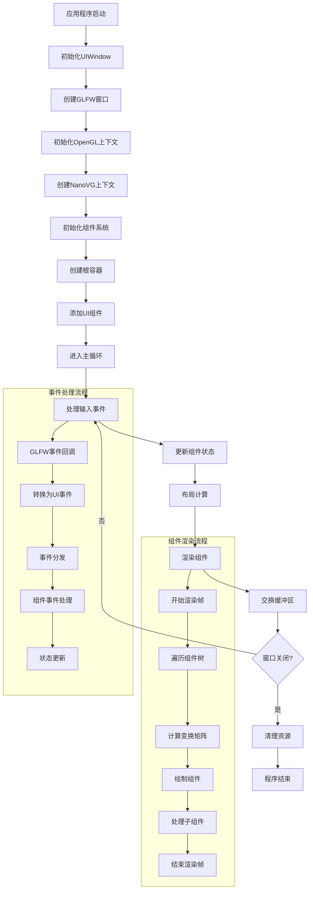

          
# 轻量级UI库基础功能设计与分解流程图

基于您当前的项目结构（UIWindow + NanoVG + GLFW），我来为您设计一个轻量级UI库的基础架构和分解流程图。

## 核心架构设计

### 1. 窗口管理层 (Window Management)

```
┌─────────────────────────────────────────┐
│              UIWindow                   │
├─────────────────────────────────────────┤
│ • 窗口创建/销毁                          │
│ • 渲染上下文管理                          │
│ • 事件循环                              │
│ • 回调系统                              │
│ • 窗口属性设置                           │
└─────────────────────────────────────────┘
```

### 2. 基础组件系统设计

```
                    UIComponent (抽象基类)
                           │
        ┌──────────────────┼──────────────────┐
        │                  │                  │
   UIWidget           UIContainer         UIControl
   (叶子组件)          (容器组件)         (交互组件)
        │                  │                  │
    ┌───┼───┐         ┌────┼────┐        ┌────┼────┐
    │   │   │         │    │    │        │    │    │
  Label Text Image   Panel VBox HBox   Button Slider Input
```

## 完整分解流程图



## 基础组件类设计

### UIComponent 基类

```cpp:src/UIComponent.h
class UIComponent {
public:
    // 基础属性
    struct Rect { float x, y, width, height; };
    struct Color { float r, g, b, a; };
    
    // 虚函数接口
    virtual void render(NVGcontext* vg) = 0;
    virtual void update(float deltaTime) {}
    virtual bool handleEvent(const UIEvent& event) { return false; }
    virtual void layout() {}
    
    // 属性管理
    void setPosition(float x, float y);
    void setSize(float width, float height);
    void setVisible(bool visible);
    
    // 层次结构
    void addChild(std::shared_ptr<UIComponent> child);
    void removeChild(std::shared_ptr<UIComponent> child);
    
protected:
    Rect bounds;
    bool visible = true;
    UIComponent* parent = nullptr;
    std::vector<std::shared_ptr<UIComponent>> children;
};
```

### UIButton 组件示例

```cpp:src/UIButton.h
class UIButton : public UIComponent {
public:
    UIButton(const std::string& text);
    
    void render(NVGcontext* vg) override;
    bool handleEvent(const UIEvent& event) override;
    
    // 按钮特有功能
    void setOnClick(std::function<void()> callback);
    void setText(const std::string& text);
    void setStyle(const ButtonStyle& style);
    
private:
    std::string text;
    ButtonStyle style;
    std::function<void()> onClick;
    bool isPressed = false;
    bool isHovered = false;
};
```

## 实现优先级建议

### 第一阶段：核心基础
1. **UIComponent 基类** - 组件系统基础
2. **UIContainer** - 容器组件
3. **基础布局系统** - 绝对定位和简单布局
4. **事件系统** - 鼠标和键盘事件

### 第二阶段：基础组件
1. **UIButton** - 按钮组件
2. **UILabel** - 文本标签
3. **UIPanel** - 面板容器
4. **基础样式系统** - 颜色、字体、边框

### 第三阶段：高级功能
1. **布局管理器** - VBox, HBox, Grid
2. **UIInput** - 输入框
3. **UISlider** - 滑块
4. **主题系统** - 可切换的UI主题

### 第四阶段：优化和扩展
1. **动画系统** - 组件动画
2. **资源管理** - 纹理、字体管理
3. **性能优化** - 渲染批处理
4. **更多组件** - 列表、树形控件等

## 目录结构建议

```
src/
├── core/
│   ├── UIWindow.h/cpp          # 窗口管理
│   ├── UIComponent.h/cpp       # 组件基类
│   ├── UIContainer.h/cpp       # 容器基类
│   └── UIEvent.h               # 事件定义
├── components/
│   ├── UIButton.h/cpp          # 按钮组件
│   ├── UILabel.h/cpp           # 标签组件
│   ├── UIPanel.h/cpp           # 面板组件
│   └── UIInput.h/cpp           # 输入组件
├── layout/
│   ├── LayoutManager.h/cpp     # 布局管理器基类
│   ├── VBoxLayout.h/cpp        # 垂直布局
│   └── HBoxLayout.h/cpp        # 水平布局
├── style/
│   ├── UIStyle.h/cpp           # 样式系统
│   └── UITheme.h/cpp           # 主题系统
└── utils/
    ├── UIUtils.h/cpp           # 工具函数
    └── ResourceManager.h/cpp   # 资源管理
```

这个设计提供了一个清晰的架构，从您现有的 <mcfile name="UIWindow.h" path="e:\Program\Learning-progect\UI\src\UIWindow.h"></mcfile> 开始，逐步构建一个功能完整的轻量级UI库。每个阶段都有明确的目标和可测试的功能点。
        